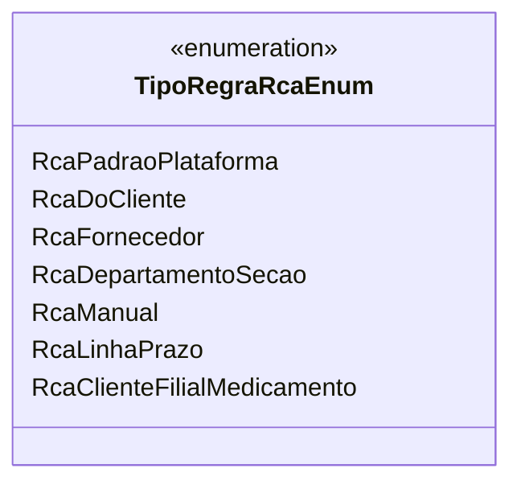

# TipoRegraRcaEnum
**Namespace**: IsthmusWinthor.Dominio.Enumeradores  
**Nome do Arquivo**: TipoRegraRcaEnum.cs

O `TipoRegraRcaEnum` é uma enumeração que define os tipos de regras RCA (Root Cause Analysis) disponíveis no sistema. Esta enumeração é crucial para categorizar as diferentes abordagens utilizadas no gerenciamento e análise de causas raiz no contexto de operação da plataforma.

## Tipos Auxiliares e Dependências
- **Enums**:
  - `[TipoRegraRcaEnum](TipoRegraRcaEnum.md)`: Representa as diferentes categorias de regras RCA.

## Diagrama de Relacionamentos

Neste documento, são exploradas as definições de tipos de regras RCA, evidenciando a estrutura da enumeração e suas finalidades.
