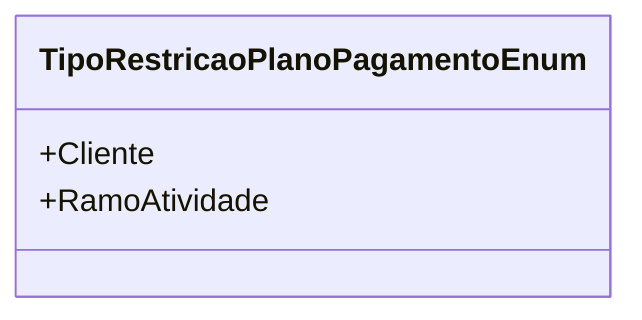

# TipoRestricaoPlanoPagamentoEnum
- **Namespace**: IsthmusWinthor.Dominio.Enumeradores
- **Nome do Arquivo**: TipoRestricaoPlanoPagamentoEnum.cs

Este enumerador é utilizado para identificar os tipos de restrições que podem ser aplicadas a planos de pagamento em um contexto de domínio específico, possibilitando a aplicação de regras de negócio que garantam a integridade e conformidade nas transações financeiras.

## Tipos Auxiliares e Dependências
- **Enumeração**: 
  - `TipoRestricaoPlanoPagamentoEnum`

## Diagrama de Relacionamentos

