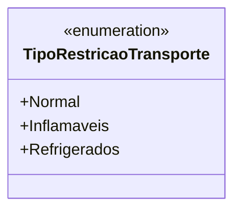

# TipoRestricaoTransporte
- **Namespace**: IsthmusWinthor.Dominio.Enumeradores
- **Nome do Arquivo**: TipoRestricaoTransporte.cs

### Visão Geral e Responsabilidade
A enumeração `TipoRestricaoTransporte` define os diferentes tipos de restrições que podem ser aplicadas ao transporte de mercadorias. Essa estrutura é crucial para garantir que produtos sejam manejados conforme suas características específicas, garantindo conformidade com regulamentos de segurança e integridade dos produtos durante o transporte.

### Tipos Auxiliares e Dependências
- `TipoRestricaoTransporte` é um tipo enum que lista três categorias principais de restrições de transporte:
  - **Normal**: Indica produtos que não possuem requisitos especiais de transporte (secados).
  - **Inflamáveis**: Representa produtos que necessitam de manuseio cuidadoso devido a serem inflamáveis (ex: laticínios).
  - **Refrigerados**: Indica mercadorias que devem ser mantidas em temperaturas controladas para preservar a qualidade (ex: frios).

### Diagrama de Relacionamentos

