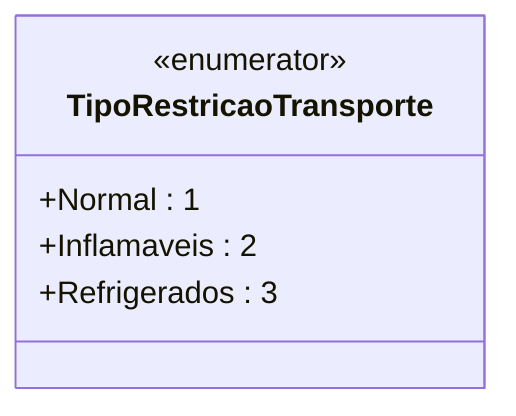

# TipoRestricaoTransporte
**Namespace**: IsthmusWinthor.Dominio.Enumeradores  
**Nome do Arquivo**: TipoRestricaoTransporte.cs  

### Visão Geral e Responsabilidade
A classe `TipoRestricaoTransporte` é um enumerador que categoriza diferentes tipos de restrições no transporte de mercadorias. Este tipo de classificação é crucial para garantir que os produtos sejam transportados de acordo com suas características específicas, respeitando normas de segurança e regulamentações do setor, além de otimizar o uso de recursos durante o transporte.

### Tipos Auxiliares e Dependências
- **Enumeradores**:
  - [TipoRestricaoTransporte](TipoRestricaoTransporte.md)

### Diagrama de Relacionamentos

---
Gerada em 29/12/2025 21:06:48
