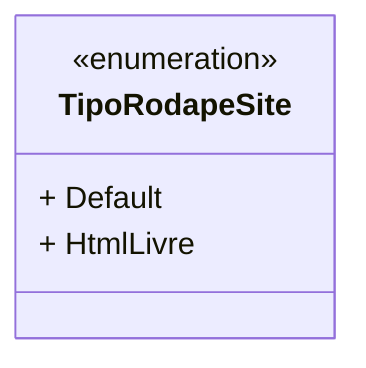

# TipoRodapeSite
- **Namespace**: IsthmusWinthor.Dominio.Enumeradores
- **Nome do Arquivo**: TipoRodapeSite.cs

O `TipoRodapeSite` é um enumerador que define os tipos de rodapés disponíveis para um site, servindo como um padrão que orienta a exibição e formatação do conteúdo no rodapé.

## Tipos Auxiliares e Dependências
- Enumeradores:
  - `[TipoRodapeSite](TipoRodapeSite.md)`

## Diagrama de Relacionamentos

