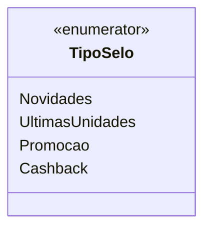

# TipoSelo
**Namespace**: IsthmusWinthor.Dominio.Enumeradores  
**Nome do Arquivo**: TipoSelo.cs  

O `TipoSelo` é um enumerador que categoriza os selos utilizados em ofertas e promoções dentro do sistema. Ele define diferentes tipos de selos que podem ser aplicados a produtos ou serviços, permitindo uma melhor comunicação e marketing atrelado às suas características.

## Tipos Auxiliares e Dependências
- Nenhuma classe estática ou helper foi identificada.
- Nenhum enumerador ou tipo auxiliar é utilizado neste arquivo, além do próprio `TipoSelo`.

## Diagrama de Relacionamentos

