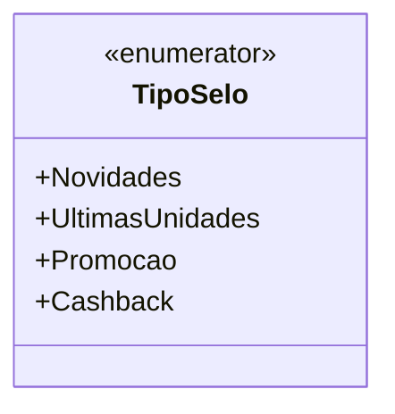

# TipoSelo
**Namespace**: IsthmusWinthor.Dominio.Enumeradores  
**Nome do Arquivo**: TipoSelo.cs  

O `TipoSelo` é um enumerador que categoriza diferentes tipos de selos que podem ser aplicados a produtos no sistema, facilitando a comunicação de promoções e novidades aos usuários. Esta classificação é essencial para a aplicação de regras de negócio que permitem a personalização da apresentação de produtos, melhorando a experiência do cliente. 

## Tipos Auxiliares e Dependências
- Nenhum.

## Diagrama de Relacionamentos

---
Gerada em 29/12/2025 21:06:56
