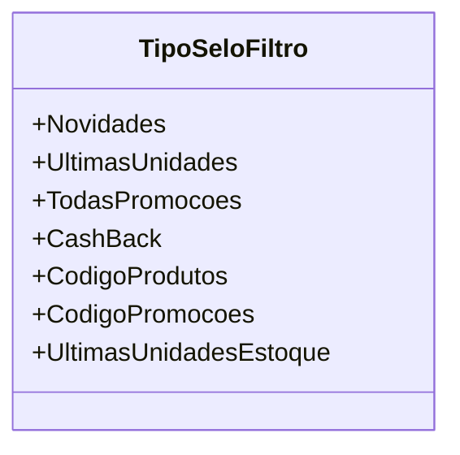

# TipoSeloFiltro
**Namespace**: IsthmusWinthor.Dominio.Enumeradores  
**Nome do Arquivo**: TipoSeloFiltro.cs  

O `TipoSeloFiltro` é um enumerador que define as diferentes categorias ou filtros aplicáveis dentro do contexto do sistema de domínio, normalmente utilizados para classificar produtos e promoções em uma interface de usuário.

## Tipos Auxiliares e Dependências
- N/A

## Diagrama de Relacionamentos

---
Gerada em 29/12/2025 21:07:01
