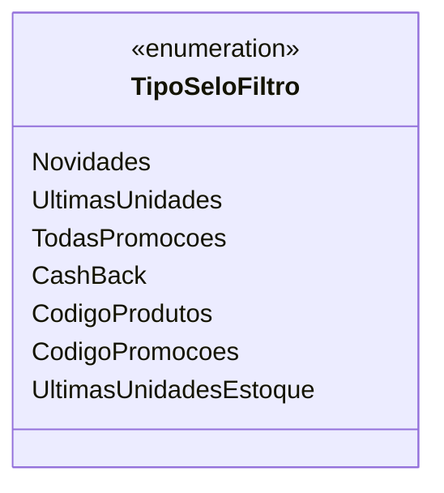

# TipoSeloFiltro
**Namespace**: IsthmusWinthor.Dominio.Enumeradores  
**Nome do Arquivo**: TipoSeloFiltro.cs  

## Visão Geral e Responsabilidade
O `TipoSeloFiltro` é um enumerador que define uma série de tipos de filtros que podem ser aplicados a produtos em um sistema de gestão de estoque ou promoções. Ele resolve a necessidade de categorização e identificação clara de diferentes critérios que podem ser utilizados para filtrar produtos, melhorando a usabilidade e a apresentação para o usuário final.

## Métodos de Negócio
Esta classe não possui métodos de negócio, uma vez que é um enumerador que serve meramente como uma lista de constantes para uso em filtros.

## Propriedades Calculadas e de Validação
Não há propriedades calculadas ou de validação nesta classe.

## Navigation Property
Não existem propriedades de navegação, pois esta classe é um enumerador simples.

## Tipos Auxiliares e Dependências
- Nenhum tipo auxiliar ou dependência adicional utilizado.

## Diagrama de Relacionamentos

