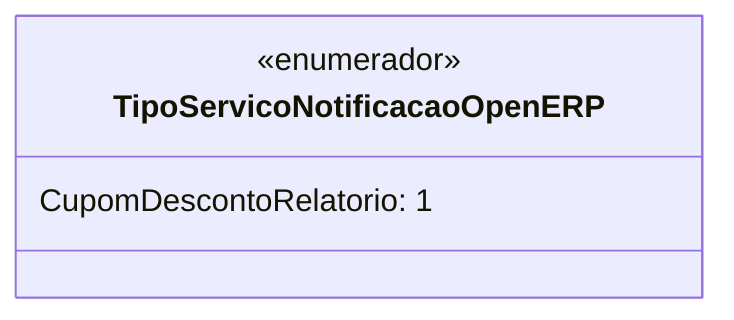

# TipoServicoNotificacaoOpenERP
**Namespace**: IsthmusWinthor.Dominio.Enumeradores  
**Nome do Arquivo**: TipoServicoNotificacaoOpenERP.cs  

O `TipoServicoNotificacaoOpenERP` é um enumerador utilizado para categorizar diferentes tipos de serviços de notificação no contexto do sistema OpenERP. Sua utilização permite uma representação clara e restrita dos tipos de serviços disponíveis, facilitando a integração e a manutenção do código.

## Tipos Auxiliares e Dependências
- Enumeradores:
  - [TipoServicoNotificacaoOpenERP](TipoServicoNotificacaoOpenERP.md)

## Diagrama de Relacionamentos

---
Gerada em 29/12/2025 21:07:05
