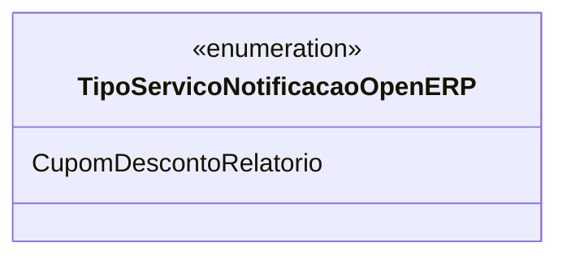

# TipoServicoNotificacaoOpenERP
**Namespace**: IsthmusWinthor.Dominio.Enumeradores  
**Nome do Arquivo**: TipoServicoNotificacaoOpenERP.cs  

Este enumerador fornece definições de tipos de serviços de notificações utilizados no sistema, facilitando a categorização e o gerenciamento de diferentes tipos de serviços.

## Tipos Auxiliares e Dependências
- Enumeradores:
  - `[TipoServicoNotificacaoOpenERP](TipoServicoNotificacaoOpenERP.md)`

## Diagrama de Relacionamentos

