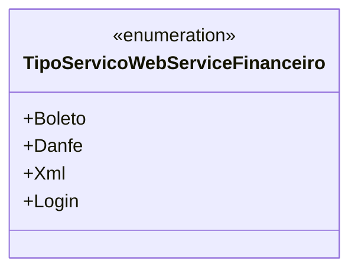

# TipoServicoWebServiceFinanceiro
**Namespace**: IsthmusWinthor.Dominio.Enumeradores  
**Nome do Arquivo**: TipoServicoWebServiceFinanceiro.cs  

Esta enumeração define os tipos de serviços disponíveis para interações com um Web Service financeiro, funcionando como uma referência para identificar cada tipo de serviço que pode ser solicitado.

### Tipos Auxiliares e Dependências
- Enumeradores: `[TipoServicoWebServiceFinanceiro](TipoServicoWebServiceFinanceiro.md)`

### Diagrama de Relacionamentos

