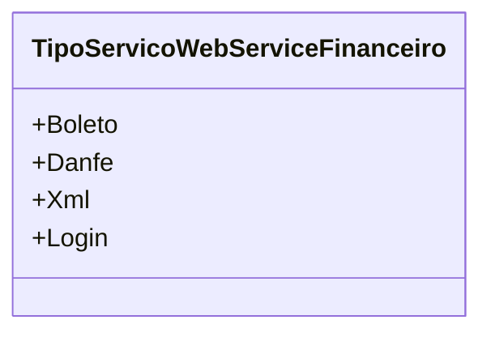

# TipoServicoWebServiceFinanceiro
**Namespace**: IsthmusWinthor.Dominio.Enumeradores  
**Nome do Arquivo**: TipoServicoWebServiceFinanceiro.cs  

Este enumerador define os tipos de serviços oferecidos por um Web Service Financeiro, servindo para facilitar a identificação e o uso adequado em operações relacionadas a serviços financeiros no sistema.

## Tipos Auxiliares e Dependências
- **Enumeradores**:
  - [TipoServicoWebServiceFinanceiro](TipoServicoWebServiceFinanceiro.md)

## Diagrama de Relacionamentos

---
Gerada em 29/12/2025 21:07:09
