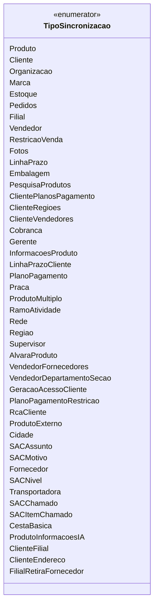

# TipoSincronizacao
**Namespace**: IsthmusWinthor.Dominio.Enumeradores  
**Nome do Arquivo**: TipoSincronizacao.cs  

## Visão Geral e Responsabilidade
O `TipoSincronizacao` é um enumerador que centraliza os diferentes tipos de sincronizações que podem ocorrer na aplicação, permitindo que o sistema reconheça e gerencie diferentes entidades de forma padronizada. Isso é crucial para garantir que todos os processos de sincronização respeitem legados de dados coesos, além de facilitar a integração e manipulação de diversas entidades do domínio.

## Tipos Auxiliares e Dependências
- **Enumeradores**:
  - `TipoSincronizacao`: Este enumerador fornece os diferentes tipos de sincronização relevantes dentro do sistema. Cada valor enumarado representa uma entidade específica que pode ser sincronizada, como `Produto`, `Cliente`, `Organizacao`, entre outros.

## Diagrama de Relacionamentos

