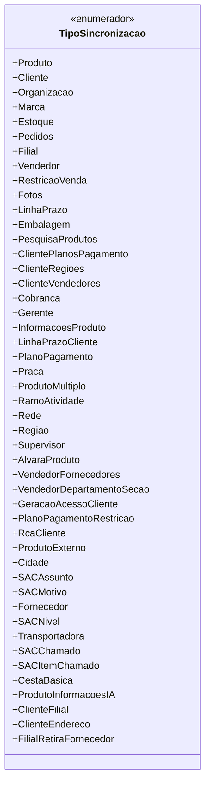

# TipoSincronizacao

**Namespace**: IsthmusWinthor.Dominio.Enumeradores  
**Nome do Arquivo**: TipoSincronizacao.cs  

O `TipoSincronizacao` é um enumerador que define os diferentes tipos de sincronizações que podem ocorrer no sistema, abrangendo entidades como produtos, clientes e vendas. Este tipo de estrutura é essencial para garantir que o sistema possa categorizar e gerenciar as diversas sincronia de informações de forma organizada e baseada em regras de negócio específicas.

## Tipos Auxiliares e Dependências
- Não há dependências adicionais ou classes estáticas específicas utilizadas nesta enumeração.

## Diagrama de Relacionamentos

Esta documentação reflete a importância do enumerador `TipoSincronizacao` no contexto do sistema, ajudando a categorizar e gerenciar diferentes aspectos da sincronização de dados, essencial para manter a integridade e organização dos fluxos de informação.
---
Gerada em 29/12/2025 21:07:20
