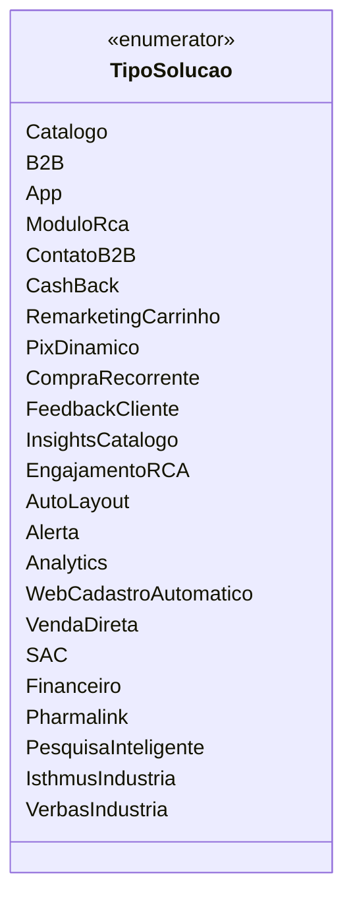

# TipoSolucao

**Namespace**: IsthmusWinthor.Dominio.Enumeradores  
**Nome do Arquivo**: TipoSolucao.cs  

O enum `TipoSolucao` é utilizado para definir diferentes tipos de soluções oferecidas na plataforma, permitindo a categorização e identificação de cada tipo de solução em processos de negócios e integrações.

## Tipos Auxiliares e Dependências
- **Nenhum**: Este enum não possui dependências externas ou tipos auxiliares associados.

## Diagrama de Relacionamentos

---
Gerada em 29/12/2025 21:07:28
