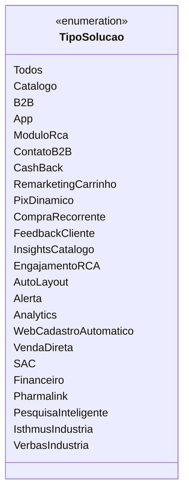

# TipoSolucao
**Namespace**: IsthmusWinthor.Dominio.Enumeradores  
**Nome do Arquivo**: TipoSolucao.cs  
  
## Visão Geral e Responsabilidade
A classe `TipoSolucao` é um enumerador que representa as diferentes soluções disponíveis dentro do sistema. Ela oferece uma lista de tipos de soluções que podem ser utilizadas em um contexto de negócios, permitindo identificar claramente qual a origem de uma operação específica. Esse padrão facilita a categorização, análise e reporting das operações no sistema, contribuindo para uma melhor tomada de decisão e gestão de processos.

## Métodos de Negócio
- **Título**: Nenhum método com lógica de negócio foi identificado.

## Propriedades Calculadas e de Validação
- **Nenhuma propriedade calculada ou de validação foi identificada.**

## Navigation Properties
- **Nenhuma propriedade de navegação foi identificada.**

## Tipos Auxiliares e Dependências
- **Nenhum enumerador ou classe estática/helper foi identificado.**

## Diagrama de Relacionamentos

