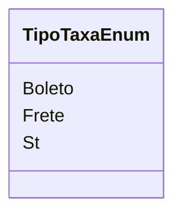

# TipoTaxaEnum
**Namespace**: IsthmusWinthor.Dominio.Enumeradores  
**Nome do Arquivo**: TipoTaxaEnum.cs  

O `TipoTaxaEnum` é um enumerador que define os diferentes tipos de taxas que podem ser aplicadas em transações financeiras dentro do sistema. Ele serve como um transporte de dados que facilita a identificação e categorização dessas taxas, assegurando que o sistema possa aplicar regras de negócios relevantes de forma robusta e consistente.

## Tipos Auxiliares e Dependências
- Nenhuma classe complexa do domínio ou propriedades associadas.  

### Enumeradores
- `[TipoTaxaEnum](TipoTaxaEnum.md)`

## Diagrama de Relacionamentos

