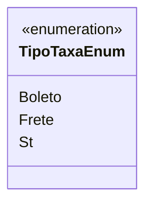

# TipoTaxaEnum
**Namespace**: IsthmusWinthor.Dominio.Enumeradores  
**Nome do Arquivo**: TipoTaxaEnum.cs  

O `TipoTaxaEnum` é uma enumeração que encapsula os diferentes tipos de taxas aplicáveis dentro do domínio, facilitando o gerenciamento e a categorização de custos associados a transações.

## Tipos Auxiliares e Dependências
- Enumerador: [TipoTaxaEnum](TipoTaxaEnum.md)

## Diagrama de Relacionamentos

---
Gerada em 29/12/2025 21:07:31
