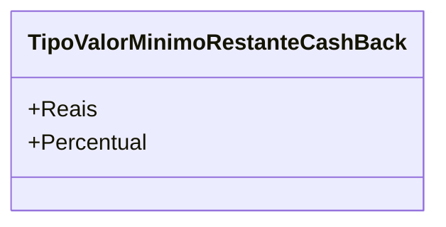

# TipoValorMinimoRestanteCashBack

**Namespace**: IsthmusWinthor.Dominio.Enumeradores  
**Nome do Arquivo**: TipoValorMinimoRestanteCashBack.cs  

O enum `TipoValorMinimoRestanteCashBack` define os diferentes tipos de valores mínimos que podem ser utilizados em um sistema de cashback, classificando as opções entre reais e percentual. Essa estrutura auxilia na validação dos valores a serem aplicados em transações financeiras, garantindo que os cálculos de cashback sejam tratados de forma consistente e clara.

## Tipos Auxiliares e Dependências
- Não existem dependências adicionais ou enums relevantes associados a esta classe, dado que ela serve como um enumerador autônomo.

## Diagrama de Relacionamentos

---
Gerada em 29/12/2025 21:07:36
