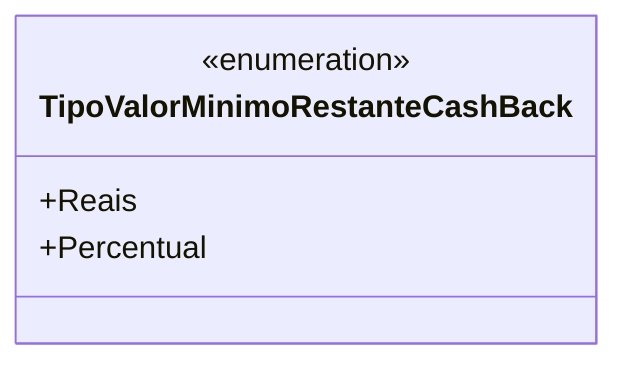

# TipoValorMinimoRestanteCashBack
**Namespace**: IsthmusWinthor.Dominio.Enumeradores  
**Nome do Arquivo**: TipoValorMinimoRestanteCashBack.cs  

### Citação
`TipoValorMinimoRestanteCashBack` é um enumerador que define os tipos de valor mínimo restante para cashback, especificando se o valor é expresso em reais ou percentual.

### Tipos Auxiliares e Dependências
- **Enumeração**:
  - `[TipoValorMinimoRestanteCashBack](TipoValorMinimoRestanteCashBack.md)`: Representa os tipos disponíveis para o valor mínimo restante de cashback.

### Diagrama de Relacionamentos

