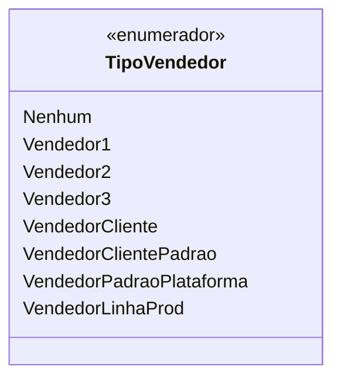

# TipoVendedor
**Namespace**: IsthmusWinthor.Dominio.Enumeradores  
**Nome do Arquivo**: TipoVendedor.cs  

O enum `TipoVendedor` é utilizado para categorizar diferentes tipos de vendedores dentro do sistema, fornecendo uma estrutura clara para a identificação e o gerenciamento de vendedores conforme suas funções e relacionamentos com clientes e produtos.

## Tipos Auxiliares e Dependências
- Enumeradores:
  - `[TipoVendedor](TipoVendedor.md)`

## Diagrama de Relacionamentos

