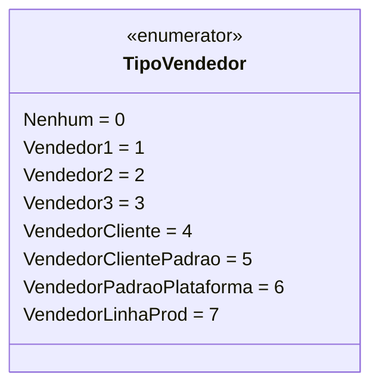

# TipoVendedor
**Namespace**: IsthmusWinthor.Dominio.Enumeradores  
**Nome do Arquivo**: TipoVendedor.cs  

O `TipoVendedor` é um enumerador que define os diferentes tipos de vendedores utilizados no sistema, sendo útil para categorizar e identificar vendedores em diferentes contextos de negócios.

## Tipos Auxiliares e Dependências
- Nenhum enumerador ou classe auxiliar adicional é referenciado por esta enumeração.

## Diagrama de Relacionamentos

---
Gerada em 29/12/2025 21:07:41
