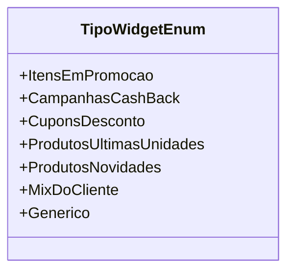

# TipoWidgetEnum
**Namespace**: IsthmusWinthor.Dominio.Enumeradores  
**Nome do Arquivo**: TipoWidgetEnum.cs  

O `TipoWidgetEnum` é um enumerador que categoriza diferentes tipos de widgets utilizados no sistema, proporcionando uma forma padronizada de representar e manipular essas categorias ao longo da aplicação.

## Tipos Auxiliares e Dependências
- Nenhum.

## Diagrama de Relacionamentos

---
Gerada em 29/12/2025 21:07:45
