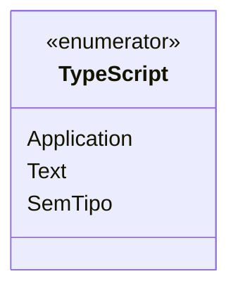

# TypeScript

**Namespace**: IsthmusWinthor.Dominio.Enumeradores  
**Nome do Arquivo**: TypeScript.cs

O enumerador `TypeScript` é utilizado para categorizar e tipificar as diferentes opções de script que podem ser aplicadas no contexto do sistema. Ele fornece uma forma de representar de maneira clara e padronizada os tipos de conteúdo, facilitando a validação e a lógica de negócios em torno da manipulação de scripts.

## Tipos Auxiliares e Dependências
- Enumerador: 
  - `[TypeScript](TypeScript.md)`

## Diagrama de Relacionamentos

