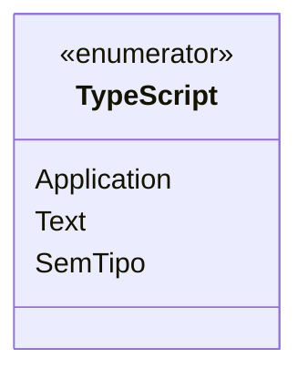

# TypeScript

**Namespace**: IsthmusWinthor.Dominio.Enumeradores  
**Nome do Arquivo**: TypeScript.cs  

## Visão Geral e Responsabilidade
A classe `TypeScript` é um enumerador que define os tipos de scripts disponíveis dentro do contexto do domínio da aplicação. Ele tem o objetivo de categorizar diferentes tipos de dados de forma a padronizar a manipulação e validação desses tipos em outras partes do sistema. Isso ajuda a garantir a integridade dos dados ao utilizar os tipos de scripts corretos nos processos de negócios.

## Métodos de Negócio
- **Título**: N/A (O enum não possui métodos de negócio com lógica.)

## Propriedades Calculadas e de Validação
- **N/A** (O enum `TypeScript` não possui propriedades calculadas ou de validação.)

## Navigation Property
- **N/A** (O enum `TypeScript` não possui propriedades de navegação.)

## Tipos Auxiliares e Dependências
- N/A (Este enumerador não depende de outros tipos ou auxiliares complexos.)

## Diagrama de Relacionamentos

---
Gerada em 29/12/2025 21:07:51
