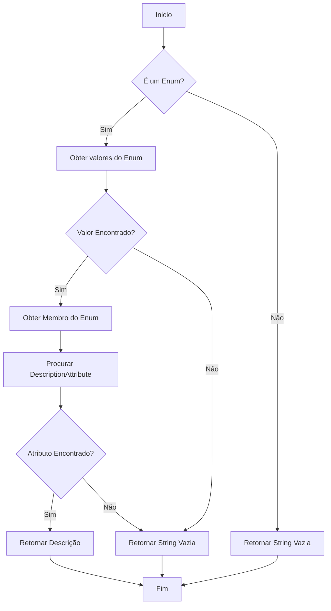
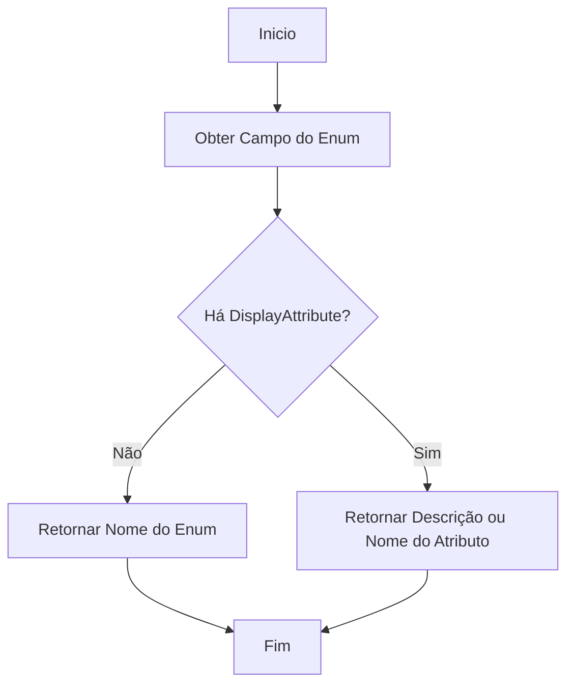
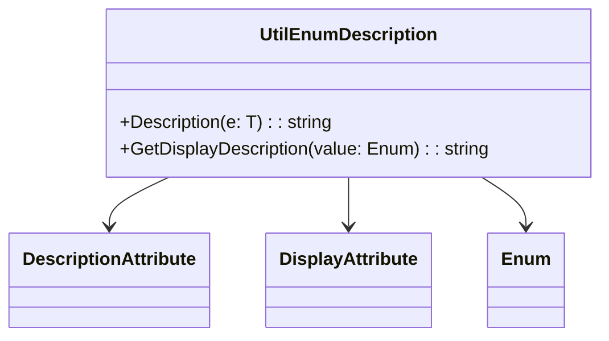

# UtilEnumDescription

**Namespace**: IsthmusWinthor.Dominio.Enumeradores  
**Nome do Arquivo**: UtilEnumDescription.cs

## Visão Geral e Responsabilidade
A classe `UtilEnumDescription` fornece métodos utilitários para enriquecer enums com descrições adicionais, suportando a recuperação de metadados através de atributos customizados. Isso resolve o problema de obter descrições legíveis para enums, melhorando a apresentação e a manutenção do código na camada de apresentação e na documentação.

## Métodos de Negócio

### Título: Description<T> (Público)
- **Objetivo**: Garantir que o valor de um enum seja mapeado para uma descrição legível através de um atributo `DescriptionAttribute`, permitindo uma melhor compreensão em interfaces e relatórios.
- **Comportamento**: 
  1. Verifica se o parâmetro `e` é um enum.
  2. Obtém o tipo do enum e seus valores possíveis.
  3. Para cada valor, compara com o valor do enum passado.
  4. Recupera o membro correspondente e procura um `DescriptionAttribute`.
  5. Retorna a descrição se encontrada; caso contrário, retorna uma string vazia.
- **Retorno**: Uma string que representa a descrição do enum, ou uma string vazia se não houver.

### Título: GetDisplayDescription (Público)
- **Objetivo**: Recuperar uma descrição formatada para um valor de enum, utilizando `DisplayAttribute` ou o próprio nome do enum, garantindo que sempre uma representação legível seja retornada.
- **Comportamento**:
  1. Obtém o campo correspondente ao valor do enum.
  2. Verifica se há um `DisplayAttribute` associado ao campo.
  3. Retorna a descrição ou nome configurado no `DisplayAttribute`, ou, se não disponível, o valor do enum em forma de string.
- **Retorno**: Uma string que representa a descrição do valor do enum, priorizando o `DisplayAttribute` se estiver disponível.

## Propriedades Calculadas e de Validação
- Não há propriedades com lógica de validação ou cálculo nesta classe, uma vez que ela é composta apenas por métodos utilitários.

## Navigation Property
- Não existem propriedades de navegação complexas nesta classe, pois não faz parte de um objeto de domínio com relacionamentos.

## Tipos Auxiliares e Dependências
- A classe faz uso de:
  - `[DescriptionAttribute](System.ComponentModel.DescriptionAttribute.md)`
  - `[DisplayAttribute](System.ComponentModel.DataAnnotations.DisplayAttribute.md)`
  - `[Enum](System.Enum.md)`

## Diagrama de Relacionamentos

