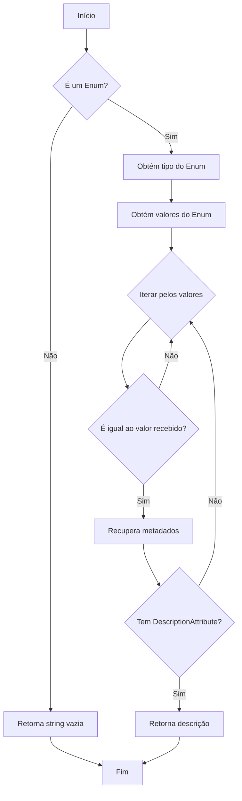
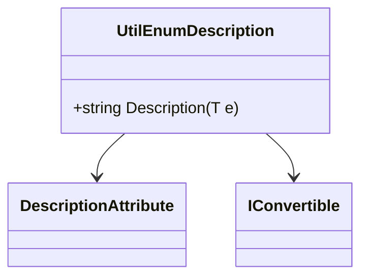

# UtilEnumDescription

**Namespace**: IsthmusWinthor.Dominio.Enumeradores  
**Nome do Arquivo**: UtilEnumDescription.cs  

## Visão Geral e Responsabilidade
A classe `UtilEnumDescription` serve como uma ferramenta utilitária para extrair descrições de enumeradores (Enums) em C#. Ela resolve o problema de proporcionar uma descrição amigável para os valores dos Enums, utilizando o atributo `[Description]`. Isso permite que as aplicações exibam representações compreensíveis e mais informativas dos Enums para os usuários, ao invés de utilizações diretas dos valores numéricos ou das chaves.

## Métodos de Negócio

### Título: Description<T> (public)
- **Objetivo**: Este método garante a obtenção da descrição associada a um valor de Enum, se disponível.
- **Comportamento**:
    1. Verifica se o objeto passado como argumento é um Enum. Se não, retorna uma string vazia.
    2. Obtém o tipo do Enum e todas os seus valores.
    3. Itera sobre cada valor do Enum.
    4. Se o valor do Enum corresponde ao valor recebido como argumento, recupera os metadados do membro do Enum utilizando `GetMember`.
    5. Verifica se existe um atributo `DescriptionAttribute` associado ao membro.
    6. Se encontrado, retorna a descrição.
    7. Se não, retorna uma string vazia após a iteração.
- **Retorno**: Retorna a descrição do Enum como uma string, ou uma string vazia se não houver descrição disponível.

## Propriedades Calculadas e de Validação
- Não existem propriedades calculadas ou de validação nesta classe.

## Navigation Properties
- Não existem propriedades de navegação nesta classe.

## Tipos Auxiliares e Dependências
- [DescriptionAttribute](https://docs.microsoft.com/dotnet/api/system.componentmodel.descriptionattribute)
- [IConvertible](https://docs.microsoft.com/dotnet/api/system.iconvertible)

## Diagrama de Relacionamentos

---
Gerada em 29/12/2025 21:08:04
