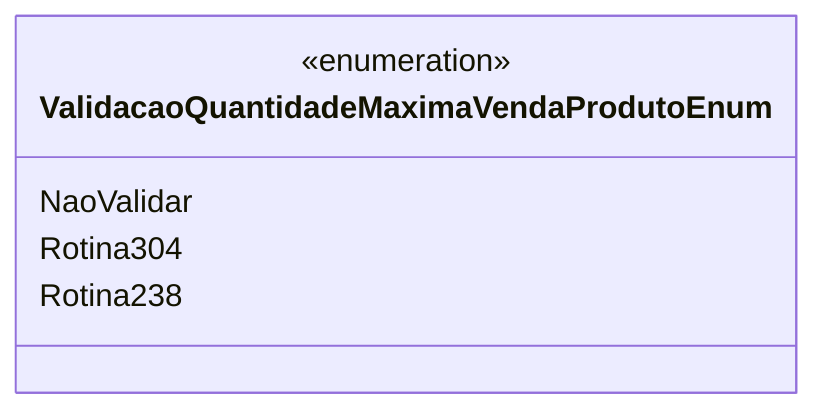

# ValidacaoQuantidadeMaximaVendaProdutoEnum
- **Namespace**: IsthmusWinthor.Dominio.Enumeradores
- **Nome do Arquivo**: ValidacaoQuantidadeMaximaVendaProdutoEnum.cs

Este enumerador é utilizado para gerenciar a validação da quantidade máxima de venda de produtos em um sistema, definindo diferentes rotinas de validação.

## Tipos Auxiliares e Dependências
- **Enumeradores**:
  - `[ValidacaoQuantidadeMaximaVendaProdutoEnum](ValidacaoQuantidadeMaximaVendaProdutoEnum.md)` - Enum que contém as opções de validação para a quantidade máxima de venda de produto.

## Diagrama de Relacionamentos

