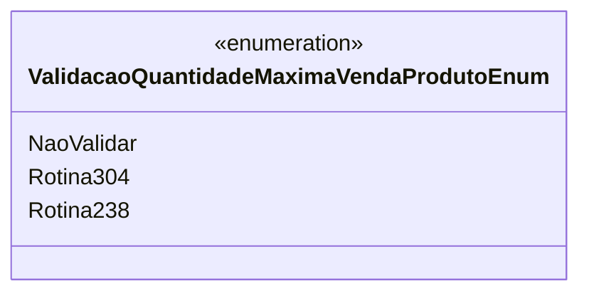

# ValidacaoQuantidadeMaximaVendaProdutoEnum
- **Namespace**: IsthmusWinthor.Dominio.Enumeradores
- **Nome do Arquivo**: ValidacaoQuantidadeMaximaVendaProdutoEnum.cs

Este é um enumerador usado para definir as opções de validação da quantidade máxima de venda de um produto. Ele é responsável por direcionar a lógica de validação em cenários de venda, garantindo que as regras de negócio aplicáveis sejam efetivamente implementadas.

## Tipos Auxiliares e Dependências
- **Enums**: 
  - [ValidacaoQuantidadeMaximaVendaProdutoEnum](ValidacaoQuantidadeMaximaVendaProdutoEnum.md)

## Diagrama de Relacionamentos

---
Gerada em 29/12/2025 21:08:08
