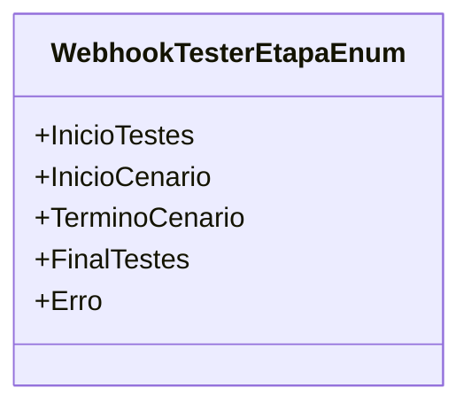

# WebhookTesterEtapaEnum
**Namespace**: IsthmusWinthor.Dominio.Enumeradores  
**Nome do Arquivo**: WebhookTesterEtapaEnum.cs  

Este enumerador tem como finalidade especificar os diferentes estágios do processo de teste de um Webhook, auxiliando na definição do fluxo de execução e controle do status do teste.

## Tipos Auxiliares e Dependências
- **Enumeradores**: 
  - `[WebhookTesterEtapaEnum](WebhookTesterEtapaEnum.md)`

## Diagrama de Relacionamentos

