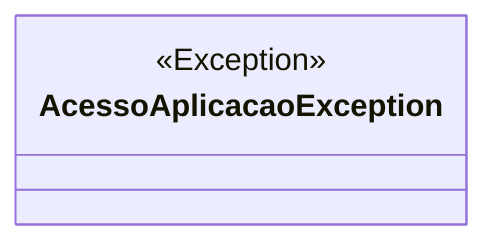

# AcessoAplicacaoException
**Namespace**: IsthmusWinthor.Dominio.Exceptions  
**Nome do Arquivo**: AcessoAplicacaoException.cs  

A classe `AcessoAplicacaoException` é uma exceção personalizada destinada a tratar erros específicos relacionados ao acesso à aplicação. Seu propósito é comunicar ao usuário que um serviço está indisponível, ajudando na identificação de problemas durante a execução de operações críticas. Ela encapsula uma mensagem padrão, mas permite a personalização da mensagem de erro conforme necessário.

## Métodos de Negócio
### Título: Construtor - `public AcessoAplicacaoException(string mensagem = "Serviço indisponível no momento!")`
- **Objetivo**: Este método garante que uma mensagem de erro adequada seja criada ao disparar a exceção, promovendo uma melhor compreensão do contexto do erro pelo usuário ou desenvolvedor.
- **Comportamento**: 
  1. O construtor da classe `AcessoAplicacaoException` é chamado.
  2. Se uma mensagem personalizada não for fornecida, a mensagem padrão "Serviço indisponível no momento!" é utilizada.
  3. O construtor da classe base `Exception` é invocado com a mensagem apropriada, finalizando a construção do objeto de exceção.
- **Retorno**: Esta é uma exceção e não possui um valor de retorno em si; no entanto, a mensagem associada ao objeto de exceção pode ser acessada quando a exceção é manipulada.

## Propriedades Calculadas e de Validação
Não há propriedades com lógica ou validação, uma vez que esta classe é uma exceção simples e serve apenas como um meio de encapsular mensagens de erro.

## Navigations Property
Não existem propriedades de navegação, pois a classe `AcessoAplicacaoException` não possui relações complexas com outras entidades no domínio.

## Tipos Auxiliares e Dependências
Não há enumeradores ou classes estáticas que a classe utilize diretamente.

## Diagrama de Relacionamentos

---
Gerada em 29/12/2025 21:09:01
