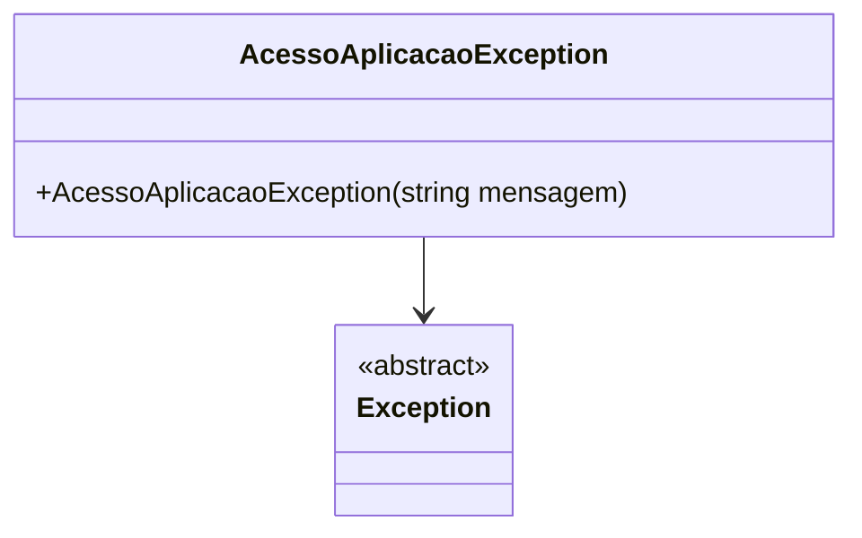

# AcessoAplicacaoException
**Namespace**: IsthmusWinthor.Dominio.Exceptions  
**Nome do Arquivo**: AcessoAplicacaoException.cs  

## Visão Geral e Responsabilidade
A classe `AcessoAplicacaoException` representa uma exceção personalizada para tratar falhas de acesso a serviços em uma aplicação. O papel desta classe é encapsular a lógica de manipulação de erros, fornecendo uma mensagem padrão que indica ao usuário que o serviço não está disponível no momento. Isso ajuda a manter a experiência do usuário ao interceptar erros e fornecer feedback claro em situações onde a aplicação não consegue acessar um recurso necessário.

## Métodos de Negócio
### Título: AcessoAplicacaoException(string mensagem) - Public
- **Objetivo**: Garante que uma mensagem de erro padrão seja fornecida em caso de falha de serviço, ou permite a personalização da mensagem quando necessário.
- **Comportamento**:
  1. A classe herda de `Exception`, permitindo o uso completo das funcionalidades do tratamento de exceções.
  2. O construtor aceita uma string como argumento; se não for fornecida, a mensagem padrão "Serviço indisponível no momento!" é utilizada.
  3. O construtor base (`base(mensagem)`) é chamado para inicializar a classe de exceção com a mensagem fornecida.
- **Retorno**: Esta classe não retorna valores, no entanto, ela encapsula a lógica de exceção para ser utilizada em fluxos de tratamento de erros na aplicação.

## Propriedades Calculadas e de Validação
Não existem propriedades calculadas ou de validação nesta classe, pois ela se concentra na configuração de um tipo de exceção.

## Navigations Property
Não há propriedades que sejam classes complexas do domínio nesta implementação.

## Tipos Auxiliares e Dependências
- Nenhum enumerador ou classe estática/auxiliar é utilizado nesta classe. O foco está apenas na herança de `Exception`.

## Diagrama de Relacionamentos

Esta documentação fornece uma visão clara da classe `AcessoAplicacaoException`, sua finalidade e como ela se integra na arquitetura geral da aplicação, mantendo as regras de negócio no centro do foco.
