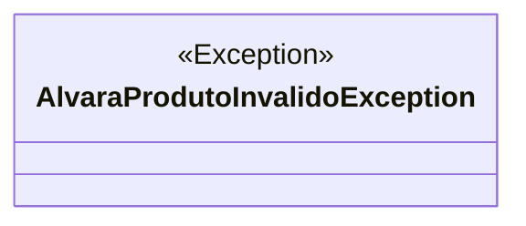

# AlvaraProdutoInvalidoException
**Namespace**: IsthmusWinthor.Dominio.Exceptions  
**Nome do Arquivo**: AlvaraProdutoInvalidoException.cs  

A classe `AlvaraProdutoInvalidoException` é uma exceção personalizada que representa um erro específico relacionado à invalidação de um alvará de produto. Essa classe é importante para o sistema, pois fornece uma maneira de sinalizar problemas que ocorrem quando um alvará de produto não atende às exigências necessárias, ajudando a manter a integridade dos processos de validação de dados e regras de negócio.

## Métodos de Negócio

### Construtor: `AlvaraProdutoInvalidoException(string mensagem)`

- **Objetivo**: Garante que mensagens de erro precisas e contextuais sejam disponibilizadas quando há uma violação relacionada a um alvará de produto.
- **Comportamento**: 
  1. Recebe uma mensagem que descreve a razão pela qual o alvará de produto é considerado inválido.
  2. Chama o construtor da classe base `Exception` com a mensagem fornecida, registrando a condição de erro que ocorreu.
- **Retorno**: Não possui retorno, mas inicializa uma instância de `AlvaraProdutoInvalidoException` com a mensagem passada para a descrição do erro.

### Construtor protegido: `AlvaraProdutoInvalidoException(System.Runtime.Serialization.SerializationInfo info, System.Runtime.Serialization.StreamingContext context)`

- **Objetivo**: Permite a desserialização da exceção, importante para cenários onde as exceções precisam ser recuperadas de um armazenamento persistente.
- **Comportamento**:
  1. Recebe informações de serialização e um contexto de streaming.
  2. Chama o construtor da classe base `Exception` para garantir que todos os dados necessários sejam corretamente configurados em caso de manuseio de exceções durante a transição entre processos.
- **Retorno**: Não possui retorno, mas garante que a exceção possa ser corretamente restaurada a partir de um estado serializado.

## Propriedades Calculadas e de Validação
Esta classe não possui propriedades calculadas ou bibliotecas internas de validação, uma vez que sua função é exclusivamente de controle de exceção e não possui lógicas de negócio adicionais.

## Navigations Property
Este tipo de classe não possui propriedades complexas de domínio, dado que a natureza dela é de exceção e não de um modelo de entidade.

## Tipos Auxiliares e Dependências
Não existem enumeradores ou classes auxiliares, pois `AlvaraProdutoInvalidoException` é uma exceção simples que não se relaciona com outros tipos de classe.

## Diagrama de Relacionamentos

Este documento fornece uma visão abrangente da classe `AlvaraProdutoInvalidoException`, sua responsabilidade em relação à validação de alvarás de produtos, e a forma como se encaixa no sistema global de exceções.
