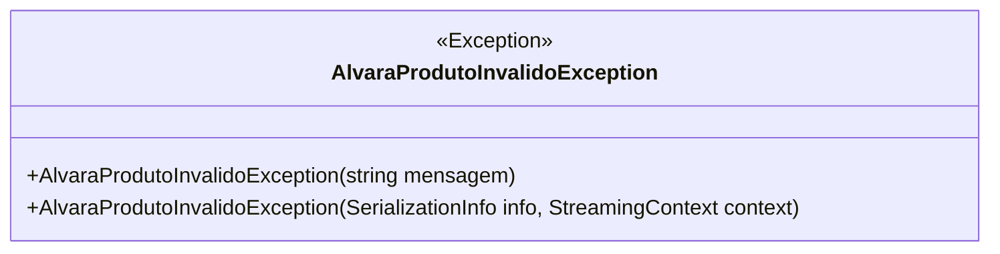

# AlvaraProdutoInvalidoException
- **Namespace**: IsthmusWinthor.Dominio.Exceptions
- **Nome do Arquivo**: AlvaraProdutoInvalidoException.cs

Esta classe é uma exceção personalizada que representa um erro relacionado à validade de um alvará de produto. Seu principal objetivo é tratar casos de falhas na validação de alvarás, permitindo uma gestão de erros mais informativa e controlada dentro da aplicação.

## Métodos de Negócio

### 1. Título: Construtor Público
- **Objetivo**: Esta classe garante que as mensagens de erro fornecidas ao instanciar a exceção sejam transmitidas adequadamente para o sistema, facilitando a identificação da causa do erro.
- **Comportamento**: Quando um novo objeto `AlvaraProdutoInvalidoException` é criado, o construtor chama o construtor da classe base `Exception`, passando a mensagem recebida. Isso assegura que, ao capturar a exceção, a mensagem correta sobre o erro de alvará será exibida.
- **Retorno**: Não há valor retornado, uma vez que se trata de um construtor de exceção; ele simplesmente instância um novo objeto de erro.

### 2. Título: Construtor Protected
- **Objetivo**: Este construtor permite a desserialização de exceções em cenários onde a aplicação pode estar lidando com exceções obtidas de outras fontes, mantendo a integridade das informações da exceção original.
- **Comportamento**: Utilizando a classe `SerializationInfo`, este construtor respeita o contexto de serialização para criar uma exceção que pode ser reconstruída em um estado válido, incluindo todas as informações relevantes, como a mensagem de erro e o contexto de streaming.
- **Retorno**: Assim como o construtor público, este construtor não tem um retorno; é utilizado para construir a exceção a partir de dados serializados.

## Propriedades Calculadas e de Validação
- Não há propriedades calculadas ou de validação nesta classe, já que se trata de uma exceção.

## Navigations Property
- Não há propriedades de navegação nesta classe, pois ela é uma exceção simples utilizada para a propagação de erros.

## Tipos Auxiliares e Dependências
- Não há enumeradores ou classes auxiliares externas utilizadas nesta classe.

## Diagrama de Relacionamentos

A classe `AlvaraProdutoInvalidoException` é uma ferramenta essencial para a validação e gestão de erros, assegurando que problemas relacionados a alvarás de produtos sejam tratados de forma clara e informativa.
---
Gerada em 29/12/2025 21:09:15
