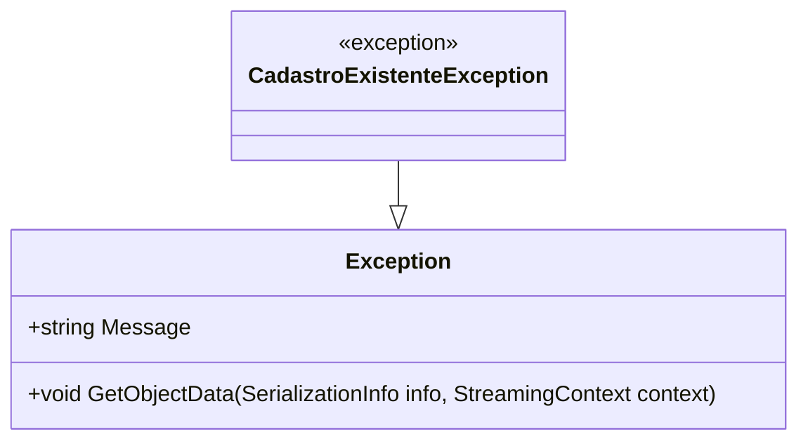

# CadastroExistenteException
**Namespace**: IsthmusWinthor.Dominio.Exceptions  
**Nome do Arquivo**: CadastroExistenteException.cs  

A classe `CadastroExistenteException` é uma representação de exceção específica utilizada para sinalizar a ocorrência de um cadastro que já existe no sistema. Essa exceção é importante para manter a integridade dos dados e garantir que não haja duplicação de registros, essencial em operações de cadastro de novas entidades no domínio.

## Métodos de Negócio
### Título: `CadastroExistenteException(string mensagem)` | Visibilidade: Public
**Objetivo**: Garantir que uma mensagem personalizada possa ser passada ao instanciar a exceção, informando o motivo específico pelo qual a exceção foi lançada.

**Comportamento**:
1. O construtor é chamado com uma string que contém a mensagem de erro a ser associada à exceção.
2. A mensagem é passada ao construtor base da classe `Exception`, que irá armazená-la para uso posterior.
3. Isso permite que o sistema que manipula a exceção possa fornecer feedback claro e informativo ao usuário ou registra-la adequadamente no log da aplicação.

**Retorno**: Não possui um retorno, mas a instância da exceção criada contém a mensagem de erro que pode ser utilizada em logs ou em tratamento de exceções.

## Propriedades Calculadas e de Validação
Não existem propriedades calculadas ou de validação na classe `CadastroExistenteException`, uma vez que se trata de uma classe de exceção simples com foco na transmissão de mensagens de erro.

## Navigation Property
Esta classe não possui propriedades de navegação, pois é uma exceção e não contém referências a outras classes do domínio.

## Tipos Auxiliares e Dependências
Esta classe não possui tipos auxiliares ou dependências de enumeradores. Entretanto, dependem da classe base `Exception`.

## Diagrama de Relacionamentos

