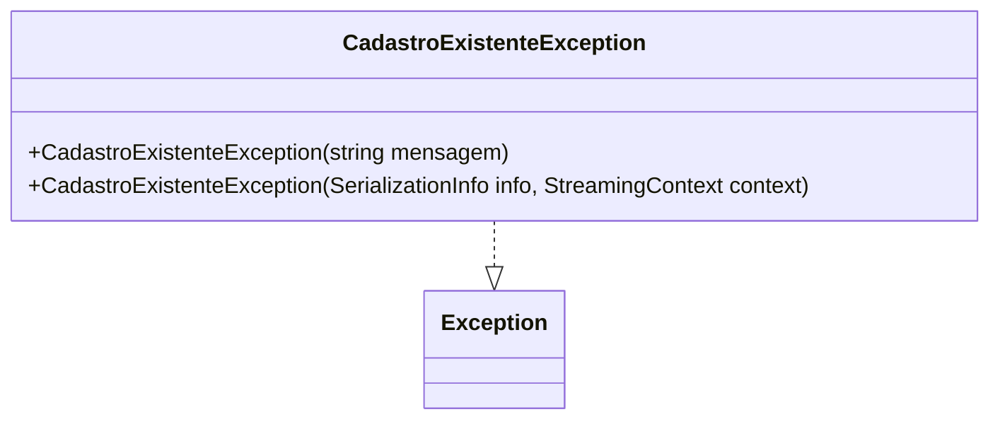

# CadastroExistenteException
- **Namespace**: IsthmusWinthor.Dominio.Exceptions
- **Nome do Arquivo**: CadastroExistenteException.cs

A classe `CadastroExistenteException` é uma exceção personalizada que representa um erro específico que ocorre no domínio quando uma tentativa de cadastro é feita para um item que já existe. Este padrão de exceção ajuda a garantir a integridade de dados no sistema, evitando duplicações que podem levar a inconsistências.

## Métodos de Negócio

### Título: CadastroExistenteException(string mensagem)
- **Objetivo**: Atender ao cenário onde um cadastro não pode ser realizado porque já existe uma entrada equivalente. Este método assegura que a lógica de negócio é respeitada ao informar o usuário de forma prática sobre a duplicidade.
- **Comportamento**: 
  1. O método é chamado quando um cadastro repetido é detectado.
  2. Ele recebe uma mensagem que descreve o erro.
  3. A mensagem é passada para o construtor da classe base `Exception`.
- **Retorno**: Não aplica, pois é um construtor de exceção.

### Título: CadastroExistenteException(SerializationInfo info, StreamingContext context)
- **Objetivo**: Permitir a serialização e desserialização da exceção personalizada para que, em cenários como a transferência de dados ou persistência, a integridade da informação sobre a exceção seja mantida.
- **Comportamento**: 
  1. Método protegido que é utilizado em processos de serialização.
  2. Recebe dois parâmetros: `info` e `context`.
  3. Chama o construtor da classe base `Exception` para garantir que a exceção seja corretamente inicializada com os dados serializados.
- **Retorno**: Não aplica, pois é parte da lógica de serialização da exceção.

## Propriedades Calculadas e de Validação
- Esta classe não possui propriedades calculadas ou de validação.

## Navigations Property
- Esta classe não possui propriedades de navegação, já que é uma exceção.

## Tipos Auxiliares e Dependências
- Nenhum enumerador ou classe estática/helper é utilizado nesta classe.

## Diagrama de Relacionamentos

---
Gerada em 29/12/2025 21:09:28
