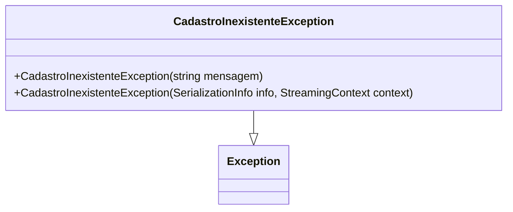

# CadastroInexistenteException
**Namespace**: IsthmusWinthor.Dominio.Exceptions  
**Nome do Arquivo**: CadastroInexistenteException.cs  

A classe `CadastroInexistenteException` é uma exceção específica utilizada para indicar a ausência de um registro ou cadastro esperado em operações que requerem a sua existência. Ela permite que o sistema gerencie erros relacionados a cadastros não encontrados de forma controlada, garantindo que os fluxos de negócios possam reagir de maneira adequada a essa situação.

## Métodos de Negócio

### Título: CadastroInexistenteException(string mensagem) - Visibilidade: Público
- **Objetivo**: Lançar uma exceção com uma mensagem específica quando um cadastro inexiste.
- **Comportamento**: 
  1. O construtor é chamado com uma mensagem detalhada sobre a condição de erro.
  2. A mensagem é passada para a classe base `Exception`, possibilitando que as informações do erro sejam acessadas nos handlers de exceção.
- **Retorno**: Não possui valor de retorno, mas a exceção criada pode ser capturada em um bloco try-catch pelo chamador para tratamento.

### Título: CadastroInexistenteException(SerializationInfo info, StreamingContext context) - Visibilidade: Protegido
- **Objetivo**: Permitir a desserialização de uma exceção que pode ter sido serializada anteriormente para preservação e recuperação de estado.
- **Comportamento**: 
  1. O construtor protegido é chamado durante o processo de desserialização.
  2. Os parâmetros 'info' e 'context' são passados para a classe base, garantindo que as informações de estado sejam restauradas corretamente.
- **Retorno**: Não possui valor de retorno. Este método é utilizado internamente durante processos de serialização e desserialização.

## Propriedades Calculadas e de Validação
N/A

## Navigations Property
N/A

## Tipos Auxiliares e Dependências
- N/A

## Diagrama de Relacionamentos

Essa documentação resume a responsabilidade e funcionamento da classe `CadastroInexistenteException`, facilitando a compreensão e utilização correta dentro do contexto do sistema.
