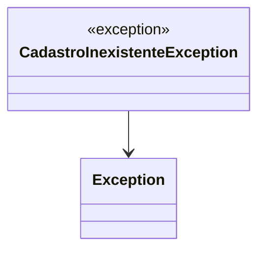

# CadastroInexistenteException
- **Namespace**: IsthmusWinthor.Dominio.Exceptions
- **Nome do Arquivo**: CadastroInexistenteException.cs

## Visão Geral e Responsabilidade
A classe `CadastroInexistenteException` é uma exceção personalizada que representa um erro específico que ocorre quando uma tentativa de acessar um cadastro que não existe é feita no sistema. Essa exceção é importante para o controle de fluxo e para garantir que as operações que dependem da existência de dados de cadastro sejam tratadas adequadamente, evitando falhas de execução e fornecendo feedback claro ao usuário ou ao sistema chamador.

## Métodos de Negócio
### 1. CadastroInexistenteException(string mensagem) - Visibilidade: Public
- **Objetivo**: Garante que uma mensagem clara e específica seja fornecida quando uma exceção de cadastro inexistente é lançada.
- **Comportamento**: Este construtor da classe `CadastroInexistenteException` aceita uma string `mensagem`, que é passada ao construtor da classe base `Exception`. Essa mensagem é usada para descrever o erro ao ser lançada. Se um desenvolvedor tenta recuperar um cadastro que não existe, a exceção pode ser lançada com uma mensagem apropriada, informando o motivo do erro.
- **Retorno**: Não há retorno de valor, pois trata-se de um construtor para instanciar a classe de exceção.

### 2. CadastroInexistenteException(SerializationInfo info, StreamingContext context) - Visibilidade: Protected
- **Objetivo**: Permite a deserialização da exceção de cadastro inexistente, preservando o estado da exceção.
- **Comportamento**: Este método construtor é invocado quando a exceção precisa ser serializada e desserializada, geralmente em cenários de remoting ou quando as exceções são transmitidas de um servidor para um cliente. Ele permite a recuperação do estado da exceção a partir do `SerializationInfo` e do `StreamingContext`, usando o construtor base para manter as informações de erro e contexto originais.
- **Retorno**: Não há retorno de valor, pois trata-se de um construtor para instanciar a classe de exceção durante o processo de deserialização.

## Propriedades Calculadas e de Validação
Não há propriedades calculadas ou de validação nessa classe, pois seu uso propõe apenas encapsular informações sobre a exceção.

## Navigations Property
Não existem propriedades complexas do domínio nesta classe.

## Tipos Auxiliares e Dependências
Nenhum tipo auxiliar ou enum é utilizado por esta classe.

## Diagrama de Relacionamentos

---
Gerada em 29/12/2025 21:09:41
