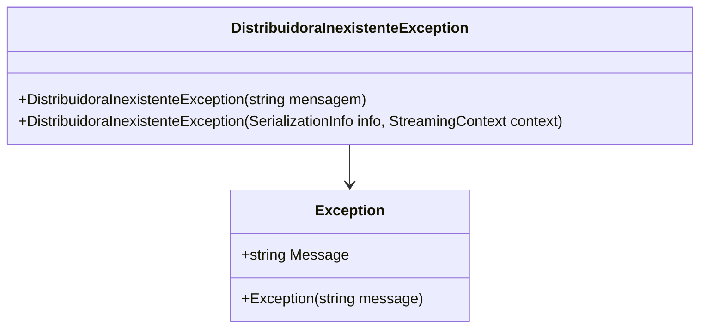

# DistribuidoraInexistenteException
**Namespace**: IsthmusWinthor.Dominio.Exceptions  
**Nome do Arquivo**: DistribuidoraInexistenteException.cs

Esta classe representa uma exceção específica que é lançada quando uma distribuidora não é encontrada no sistema, garantindo assim que o fluxo de dados seja consistente e informando ao usuário sobre a ausência de informações críticas.

## Métodos de Negócio
### Título: Construtor (public)
**Objetivo**: Garante que uma mensagem padrão ou específica seja definida ao lançar a exceção da distribuidora inexistente, permitindo identificar o problema durante o tratamento de erros.

**Comportamento**:
1. Chamado ao instanciar o objeto `DistribuidoraInexistenteException`.
2. A mensagem padrão "Nenhuma Distribuidora identificada!" é aplicada se nenhuma mensagem adicional for fornecida.
3. Essa mensagem pode ser substituída por uma mensagem personalizada, passada como argumento.
4. A base da classe `Exception` é chamada para registrar a mensagem.

**Retorno**: Esta construção não retorna um valor, mas cria uma nova instância da exceção que pode ser lançada e capturada em estruturas de tratamento de erro.

### Título: Construtor de Serialização (protected)
**Objetivo**: Permitir a reinicialização da exceção durante a serialização, assegurando que as informações passe por um processo de reinstância adequado em cenários que exigem serialização.

**Comportamento**:
1. Este construtor é utilizado quando a exceção é serializada e em seguida desserializada.
2. Utiliza `SerializationInfo` e `StreamingContext` para transportar o estado da exceção.
3. Chama o construtor base da classe `Exception` para garantir que todas as informações criadas anteriormente sejam preservadas durante a serialização.

**Retorno**: Esta construção não retorna um valor, mas prepara a exceção para ser cuidadosamente restaurada a partir de um estado serializado.

## Propriedades Calculadas e de Validação
- Não há propriedades calculadas ou de validação nessa classe, pois ela é uma implementação direta da classe de exceção, sem lógica adicional.

## Navigation Property
- Nenhuma propriedade Navigation nesta classe.

## Tipos Auxiliares e Dependências
- Nenhum enumerador ou tipo auxiliar é utilizado diretamente nesta classe.

## Diagrama de Relacionamentos

---
Gerada em 29/12/2025 21:09:54
