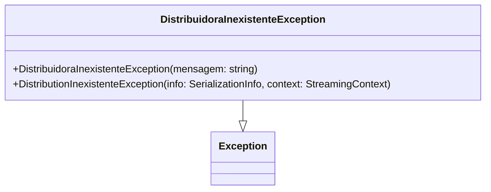

# DistribuidoraInexistenteException
- **Namespace**: IsthmusWinthor.Dominio.Exceptions
- **Nome do Arquivo**: DistribuidoraInexistenteException.cs

A classe `DistribuidoraInexistenteException` é uma exceção personalizada utilizada para sinalizar que uma distribuidora não foi identificada em um determinado contexto de negócios. Essa classe ajuda a encapsular a lógica de erro, permitindo que outros componentes do sistema tratem erros relacionados à ausência de distribuidoras de maneira consistente e informativa.

## Métodos de Negócio

### Título: Construtor Público
- **Objetivo**: Garante que a exceção contenha uma mensagem padrão de erro, facilitando a identificação do problema quando não há distribuidoras.
- **Comportamento**: O construtor inicializa a exceção com uma mensagem predefinida, caso nenhuma mensagem específica seja fornecida. Essa prática torna a manipulação de erros mais clara e organizada ao longo da aplicação.
- **Retorno**: O construtor não retorna um valor, mas cria uma instância das exceções que podem ser lançadas e tratadas em outras partes do sistema.

### Título: Construtor de Serialização
- **Objetivo**: Permite a serialização da exceção, útil em cenários de distribuição de exceções em sistemas distribuídos, garantindo que a informação do erro possa ser transmitida.
- **Comportamento**: Este construtor é utilizado em casos onde a exceção é serializada e desserializada, como em chamadas de API, preservando o contexto do erro.
- **Retorno**: O construtor não retorna um valor, mas possibilita a correta representação da exceção em outros contextos.

## Propriedades Calculadas e de Validação
Não existem propriedades calculadas ou de validação nesta classe, uma vez que trata-se uma exceção que contém somente a lógica relacionada ao tratamento de erros.

## Navigations Property
Não existem propriedades complexas de domínio a serem listadas.

## Tipos Auxiliares e Dependências
- Não há enumeradores ou classes auxiliares utilizadas nesta classe.

## Diagrama de Relacionamentos

Este diagrama ilustra a herança da `DistribuidoraInexistenteException` da classe base `Exception`, permitindo que ela se comporte como uma exceção comum no C#.
