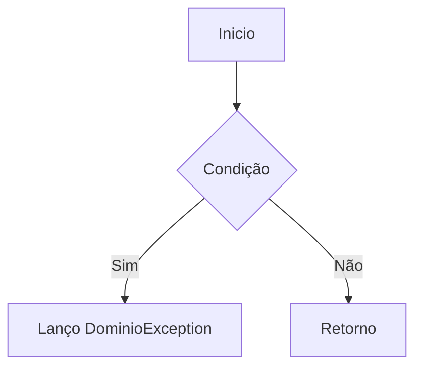
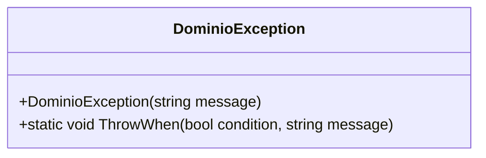

# DominioException
**Namespace**: IsthmusWinthor.Dominio.Exceptions  
**Nome do Arquivo**: DominioException.cs  

## Visão Geral e Responsabilidade
A classe `DominioException` é um mecanismo de controle de exceções projetado para o domínio da aplicação. O objetivo principal é centralizar a gestão de exceções específicas do domínio, permitindo que regras de negócio sejam validadas e, se necessário, que uma exceção adequada seja lançada com uma mensagem descritiva. Essa implementação garante que o código do domínio permaneça claro e que erros sejam tratados de maneira consistente.

## Métodos de Negócio

### Título: ThrowWhen (Estático)
- **Objetivo**: Este método garante que, se uma determinada condição for verdadeira, uma exceção `DominioException` será lançada. Isso é fundamental para a validação de regras de negócio que não devem ser violadas.
- **Comportamento**: 
    1. O método recebe uma condição booleana e uma mensagem.
    2. Se a condição for verdadeira, o método cria e lança uma instância de `DominioException` com a mensagem fornecida.
    3. Se a condição for falsa, o método não faz nada e simplesmente retorna, permitindo que o fluxo de execução continue normal.
- **Retorno**: O método não retorna um valor. O seu objetivo é influenciar o fluxo de execução através da exceção lançada.

### Visualização

## Propriedades Calculadas e de Validação
- Esta classe não possui propriedades calculadas ou de validação.

## Navigations Property
- Esta classe não possui propriedades de navegação complexas.

## Tipos Auxiliares e Dependências
- Esta classe não depende de nenhum enumerador ou classe estática/helper.

## Diagrama de Relacionamentos

---
Gerada em 29/12/2025 21:10:05
