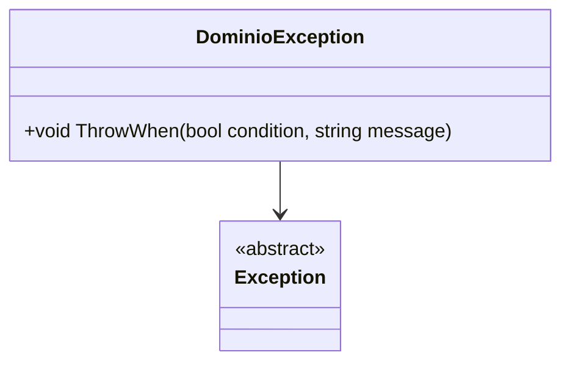

# DominioException

**Namespace**: IsthmusWinthor.Dominio.Exceptions  
**Nome do Arquivo**: DominioException.cs  

## Visão Geral e Responsabilidade
A classe `DominioException` atua como uma exceção personalizada para o domínio da aplicação. Seu propósito é encapsular a lógica de lançamento de exceções que são relevantes para as regras de negócio. Ela resolve o problema de manutenibilidade e clareza no manuseio de erros relacionados a regras internas de domínio, permitindo que condições específicas sejam verificadas e tratadas de maneira centralizada.

## Métodos de Negócio

### Título: `ThrowWhen` e Visibilidade: `public static`
- **Objetivo**: Garante que uma exceção de domínio seja lançada quando uma condição específica for verdadeira, ajudando a validar regras de negócio importantes em tempo de execução.
- **Comportamento**:
  1. O método recebe uma condição booleana e uma mensagem de erro.
  2. Se a condição for verdadeira, uma `DominioException` é lançada com a mensagem fornecida.
  3. Caso contrário, a execução continua sem interrupções.
- **Retorno**: O método não retorna nenhum valor, mas pode interromper a execução da aplicação ao lançar a exceção.

```mermaid
flowchart TD
    A{condition} -->|true| B[throw DominioException(message)]
    A -->|false| C[continue execution]
```

## Propriedades Calculadas e de Validação
- A classe não possui propriedades com lógica de cálculo ou validação.

## Navigations Property
- A classe não possui propriedades complexas do domínio.

## Tipos Auxiliares e Dependências
- A classe `DominioException` herda de `Exception`, que é uma classe padrão do .NET.
- Não utiliza enumeradores ou classes auxiliares específicas.

## Diagrama de Relacionamentos

