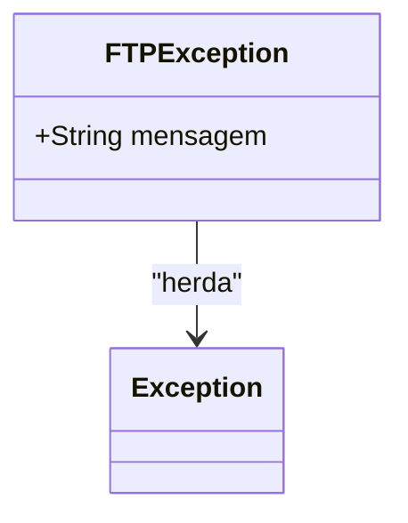

# FTPException
**Namespace**: IsthmusWinthor.Dominio.Exceptions.FTP  
**Nome do Arquivo**: FTPException.cs  

A classe `FTPException` é utilizada para encapsular erros relacionados a operações de FTP (File Transfer Protocol). Sua principal responsabilidade é fornecer uma exceção específica que possa ser lançada quando ocorrem falhas durante a comunicação ou transferência de arquivos via FTP, auxiliando no tratamento de erros em aplicações que dependem deste protocolo.

## Métodos de Negócio

### Construtor: FTPException(string mensagem)
- **Objetivo**: Criar uma nova instância da exceção, proporcionando uma mensagem detalhada sobre o erro ocorrido.
- **Comportamento**: Quando este construtor é invocado, ele armazena a mensagem de erro que pode ser recuperada posteriormente, permitindo que o contexto do erro seja compreendido no ponto de captura da exceção.
- **Retorno**: Não aplica, pois é um construtor.

### Construtor: FTPException(SerializationInfo info, StreamingContext context)
- **Objetivo**: Permitir a serialização e desserialização da exceção, o que é fundamental para o tratamento de exceções em ambientes distribuídos.
- **Comportamento**: Este construtor é invocado durante o processo de serialização, recuperando os detalhes da exceção a partir dos parâmetros fornecidos.
- **Retorno**: Não aplica, pois é um construtor.

## Propriedades Calculadas e de Validação
Não há propriedades calculadas ou de validação nesta classe, uma vez que sua função primária é a de lançar exceções.

## Navigations Property
Não possui propriedades complexas do domínio.

## Tipos Auxiliares e Dependências
Não há enumeradores ou classes auxiliares utilizadas nesta classe.

## Diagrama de Relacionamentos

Esta documentação fornece uma visão clara e estruturada sobre a classe `FTPException`, seus métodos e sua função no contexto do sistema.
