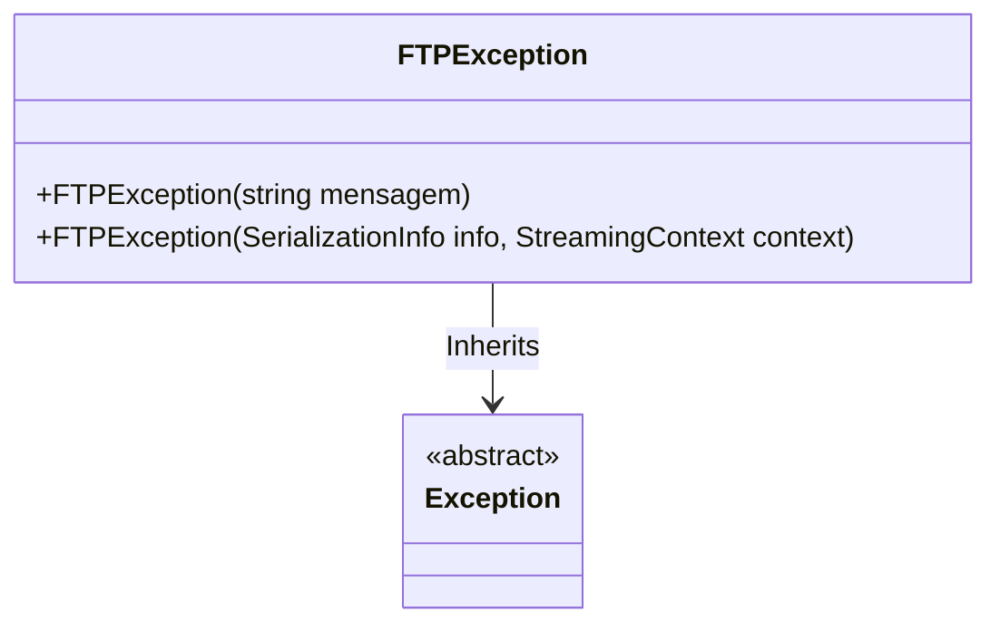

# FTPException

**Namespace**: IsthmusWinthor.Dominio.Exceptions.FTP  
**Nome do Arquivo**: FTPException.cs  

A classe `FTPException` é uma exceção personalizada que é lançada para indicar condições de erro específicas relacionadas ao uso do protocolo FTP. Ela permite que o sistema trate erros associados a operações de FTP de maneira controlada e consistente, melhorando a robustez da aplicação.

## Métodos de Negócio

### Título: FTPException(string mensagem) - Público
- **Objetivo**: Este construtor serve para criar uma instância da exceção com uma mensagem de erro específica. Ele permite que a lógica de tratamento de exceção capture detalhes importantes do erro ocorrido durante operações de FTP, como falhas de conexão ou de autenticação.
- **Comportamento**: 
  1. O construtor recebe uma string `mensagem` que descreve o erro.
  2. Ele chama o construtor base da classe `Exception`, passando a mensagem para o construtor da classe pai.
- **Retorno**: Não retorna um valor, mas cria uma nova instância da exceção com a mensagem designada para que possa ser lançada durante o fluxo de execuções do sistema.

### Título: FTPException(SerializationInfo info, StreamingContext context) - Protegido
- **Objetivo**: Este construtor é usado durante a desserialização para reidratar a exceção a partir de um stream de dados. Ele garante que a exceção possa ser restaurada em um estado válido durante as operações de serialização e desserialização, que podem ser essenciais em sistemas distribuídos.
- **Comportamento**: 
  1. Recebe dois parâmetros: `info`, que contém os dados de serialização, e `context`, que fornece a informação do contexto de streaming.
  2. Chama o construtor da classe base `Exception`, passando os parâmetros para restaurar o estado da exceção.
- **Retorno**: Não retorna um valor, mas reconstitui a exceção a partir do estado serializado.

## Diagrama de Relacionamentos

## Tipos Auxiliares e Dependências
- Nenhum tipo auxiliar ou enumerador externo é utilizado na classe `FTPException`.
---
Gerada em 29/12/2025 21:11:28
