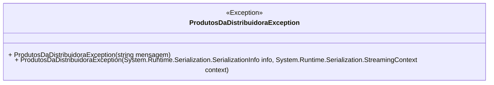

# ProdutosDaDistribuidoraException
**Namespace**: IsthmusWinthor.Dominio.Exceptions.FTP  
**Nome do Arquivo**: ProdutosDaDistribuidoraException.cs  

A classe `ProdutosDaDistribuidoraException` é uma extensão da classe base `Exception` e serve como um mecanismo para manipular erros específicos relacionados a produtos de distribuidoras no contexto do sistema. O uso desse tipo de exception permite implementar um controle mais robusto e específico sobre as falhas que podem ocorrer durante operações que envolvem produtos nas distribuidoras, melhorando a capacidade de resposta do sistema a essas situações.

## Métodos de Negócio

### Título: Construtor público
**Visibilidade**: `public`  
**Objetivo**: Garantir que mensagens específicas de erro relacionadas a produtos de distribuidoras sejam propagadas corretamente durante a exceção.  
**Comportamento**: Recebe uma mensagem de erro como argumento e a passa para a classe base `Exception`.  
**Retorno**: Não possui retorno, é um construtor.

### Título: Construtor protegido para serialização
**Visibilidade**: `protected`  
**Objetivo**: Proporcionar a capacidade de serializar a exceção, preservando o contexto durante a transferência do objeto de exceção.  
**Comportamento**: Recebe um objeto de `SerializationInfo` e um `StreamingContext`, ambos são utilizados para serialização e deserialização. Este construtor é chamado quando a exceção é serializada, garantindo que todos os detalhes relevantes sejam mantidos.  
**Retorno**: Não possui retorno, é um construtor.

## Propriedades Calculadas e de Validação
Nenhuma propriedade calculada ou de validação está presente nesta classe, pois ela é uma implementação pura de uma exceção.

## Navigation Property
Nenhuma propriedade de navegação está presente nesta classe, visto que ela deriva diretamente de `Exception`.

## Tipos Auxiliares e Dependências
Nenhum tipo auxiliar, enum ou classe estática/utility é utilizado nesta classe.

## Diagrama de Relacionamentos

