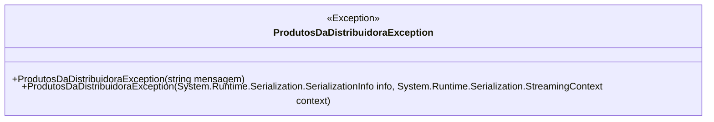

# ProdutosDaDistribuidoraException
**Namespace**: IsthmusWinthor.Dominio.Exceptions.FTP  
**Nome do Arquivo**: ProdutosDaDistribuidoraException.cs  

A classe `ProdutosDaDistribuidoraException` é um modelo de exceção específico usado para sinalizar erros relacionados ao processo de distribuição de produtos. Ela encapsula uma mensagem de erro que pode ocorrer durante a manipulação de produtos dentro do domínio de distribuição.

### Métodos de Negócio

#### Título: ProdutosDaDistribuidoraException(string mensagem) - Público
- **Objetivo**: Lançar uma exceção com uma mensagem específica que descreve o erro relacionado à distribuição de produtos da distribuidora.
- **Comportamento**: 
  1. O construtor recebe uma string `mensagem` como parâmetro.
  2. A mensagem é passada para o construtor da classe base `Exception`, que é responsável por armazenar as informações da exceção.
- **Retorno**: O método não retorna valores, mas instancia um objeto de exceção que pode ser capturado em um bloco `try-catch`.

#### Título: ProdutosDaDistribuidoraException(System.Runtime.Serialization.SerializationInfo info, System.Runtime.Serialization.StreamingContext context) - Protegido
- **Objetivo**: Permitir a serialização da exceção durante processos de transmissão ou armazenamento de dados.
- **Comportamento**: 
  1. Este construtor é chamado durante a desserialização de uma exceção capturada.
  2. Ele utiliza os parâmetros de `SerializationInfo` e `StreamingContext` para restaurar o estado da exceção.
- **Retorno**: O método não retorna valores, mas permite a recuperação de instâncias de exceção em contextos de serialização.

### Diagrama de Relacionamentos

### Tipos Auxiliares e Dependências
- Nenhum enumerador ou classe auxiliar está listado nesta classe.
---
Gerada em 29/12/2025 21:11:37
