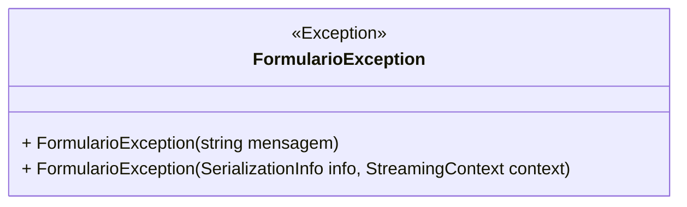

# FormularioException
**Namespace**: IsthmusWinthor.Dominio.Exceptions  
**Nome do Arquivo**: FormularioException.cs  

A classe `FormularioException` é uma exceção personalizada que tem como propósito encapsular erros relacionados a formulários dentro do domínio da aplicação. Ela permite que erros específicos de manipulação de formulários sejam lançados e tratados de maneira adequada, contribuindo para uma gestão de erros mais eficiente e específica no contexto da aplicação.

## Métodos de Negócio
### Título: `FormularioException(string mensagem)` - Public
- **Objetivo**: Este construtor garante que uma mensagem de erro específica possa ser fornecida ao criar uma instância da `FormularioException`, facilitando a identificação e tratamento de erros no contexto do formulário.
- **Comportamento**: 
  1. A classe herda de `Exception`, permitindo que todos os comportamentos de exceção padrão sejam retidos.
  2. O construtor chama o construtor base da classe `Exception`, passando a mensagem personalizada. Essa mensagem será utilizada para descrever o erro que ocorreu.
- **Retorno**: Não há valor retornado, pois o construtor é utilizado para instanciar a classe `FormularioException`.

### Título: `FormularioException(SerializationInfo info, StreamingContext context)` - Protected
- **Objetivo**: Este construtor é responsável por permitir a desserialização da exceção, garantindo que a informação da exceção possa ser restaurada em um contexto onde a `FormularioException` foi previamente serializada.
- **Comportamento**: 
  1. O construtor passa as informações de serialização para o construtor base da classe `Exception`, assegurando que todos os dados relevantes sejam devidamente restaurados.
- **Retorno**: Não há valor retornado, pois o construtor é utilizado para instanciar a classe `FormularioException` durante o processo de desserialização.

## Propriedades Calculadas e de Validação
- Esta classe não possui propriedades que envolvem lógica de cálculo ou validação.

## Navigations Property
- Não há propriedades complexas do domínio ou navegações nesta classe.

## Tipos Auxiliares e Dependências
- Esta classe não possui enumeradores (enums) ou classes estáticas/helpers que utilize.

## Diagrama de Relacionamentos

Esta documentação reflete a lógica e regras de negócio associadas à classe `FormularioException`, evidenciando seu papel como uma exceção específica para o contexto de formulários na aplicação.
---
Gerada em 29/12/2025 21:10:18
