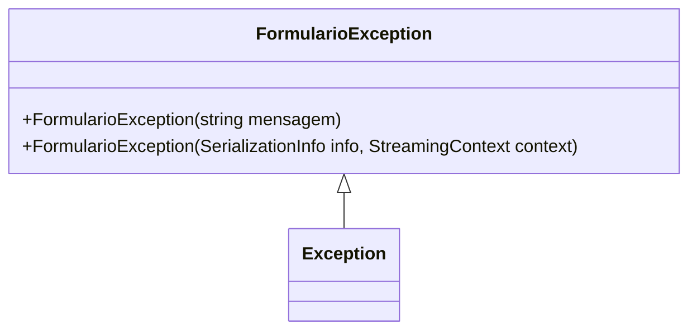

# FormularioException
**Namespace**: IsthmusWinthor.Dominio.Exceptions  
**Nome do Arquivo**: FormularioException.cs  

Esta classe representa uma exceção específica que pode ocorrer em situações relacionadas à validação de formularários na aplicação. Ela permite uma melhor identificação e tratamento de erros que surgem durante a manipulação e validação de dados de entrada de um formulário. 

## Métodos de Negócio
### Title: FormularioException (Construtor)
- **Objetivo**: Este método é responsável por inicializar uma nova instância da classe `FormularioException`, fornecendo uma mensagem de erro relevante. 
- **Comportamento**: Ao instanciar a classe, a mensagem passada é repassada para o construtor da classe base `Exception`, que gerencia a exibição dessa mensagem quando a exceção é tratada.
- **Retorno**: Este método não retorna valor, mas cria uma nova instância de `FormularioException` que pode ser utilizada pelo sistema para sinalizar erros específicos.

### Title: FormularioException (Construtor de Serialização)
- **Objetivo**: Este método é utilizado em situações onde a exceção precisa ser serializada, por exemplo, ao transferir a exceção entre diferentes domínios de aplicação ou ao armazenar em um arquivo de log.
- **Comportamento**: Ele recupera informações de serialização e chamadas à classe base para garantir que todos os dados contextuais da exceção sejam mantidos.
- **Retorno**: Este método não retorna valor, mas é utilizado para manter a integridade da exceção quando serializada.

## Propriedades Calculadas e de Validação
Nenhuma propriedade com lógica de cálculo ou validação é presente nesta classe.

## Navigations Property
Nenhuma propriedade complexa do domínio é presente nesta classe.

## Tipos Auxiliares e Dependências
- Nenhum enumerador ou classe auxiliar é utilizado nesta classe. 

## Diagrama de Relacionamentos

Este diagrama resume a relação da `FormularioException` com sua classe base `Exception`, representando sua herança.
