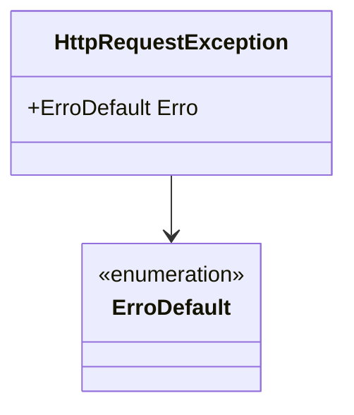

# HttpRequestException
**Namespace**: IsthmusWinthor.Dominio.Exceptions  
**Nome do Arquivo**: HttpRequestException.cs  

HttpRequestException é uma classe que representa uma exceção específica relacionada a falhas em requisições HTTP na aplicação. Ela é usada para encapsular informações detalhadas sobre o erro, facilitando o tratamento e a lógica de erro na camada de apresentação ou serviços que interagem com APIs.

## Métodos de Negócio
### Construtor: `HttpRequestException(ErroDefault erro)` 
- **Objetivo**: Garante que uma instância da exceção HTTP seja criada com detalhes relevantes sobre o erro ocorrido.
- **Comportamento**: 
  1. Recebe um objeto `ErroDefault` que contém informações detalhadas sobre o erro.
  2. Chama o construtor da classe base `Exception`, passando a descrição do erro (`erro.Detail`).
  3. Armazena o objeto `ErroDefault` na propriedade `Erro` para acesso posterior.
- **Retorno**: Não há retorno, apenas inicializa uma nova instância da exceção.

### Construtor: `HttpRequestException()` 
- **Objetivo**: Permite a criação de uma instância da exceção sem detalhes de erro.
- **Comportamento**: Inicializa a classe base `Exception` sem passar nenhum detalhe.
- **Retorno**: Não há retorno, apenas inicializa uma nova instância da exceção.

## Propriedades Calculadas e de Validação
- **Erro**: Esta propriedade do tipo `ErroDefault` é utilizada para armazenar informações detalhadas sobre uma falha específica em uma requisição HTTP. 
  - **Regra**: A propriedade é definida durante a construção da exceção e fornece informações acessíveis ao manipulador de exceções que irá processar a falha.

## Navigation Properties
- **ErroDefault**: Assume-se que exista uma classe chamada `ErroDefault`, que é um dos componentes essenciais para o tratamento da lógica de erro.
  - [ErroDefault](ErroDefault.md)

## Tipos Auxiliares e Dependências
- **ErroDefault**: Enumerador ou classe auxiliar que representa detalhes do erro.
  - [ErroDefault](ErroDefault.md)

## Diagrama de Relacionamentos

